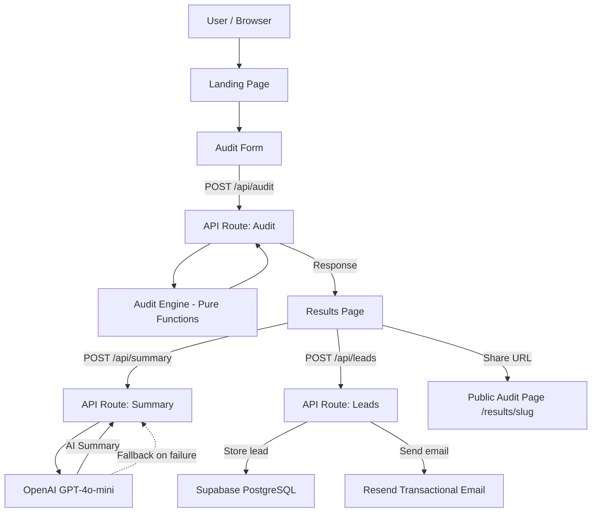

# Architecture

## System Diagram

## Data Flow

1. **User fills form** - Selects tools, plans, seats, spend. Form state persists in localStorage.
2. **Form submit** - Client POSTs to `/api/audit` with validated input (Zod schema).
3. **Audit engine** - `auditAll()` runs three checks per tool (plan fit, cheaper alternative, redundancy detection). All pure functions, no API calls.
4. **Results render** - Client receives results + slug, navigates to `/results/[slug]`.
5. **AI summary** - Client triggers POST to `/api/summary`, which calls OpenAI GPT-4o-mini. On failure (429, 500, timeout), falls back to a templated summary built from audit data.
6. **Lead capture** - After 10 seconds, email capture form appears. POST to `/api/leads` stores in Supabase and triggers Resend confirmation email. Honeypot field for bot detection.
7. **Share URL** - `/results/[slug]` is the public shareable page. Dynamic OG tags for social previews.

## Stack Choices

### Next.js App Router
- **Why:** Server Components reduce client JS bundle. API routes live in the same repo (no separate backend). Vercel deployment is zero-config.
- **Alternative considered:** Vite + Express. Rejected because two deployments, no SSR for OG tags, more infra to manage.

### Supabase
- **Why:** Free tier is generous (500MB, 50K requests). Built-in Row Level Security. PostgREST API means no ORM needed. Real PostgreSQL under the hood.
- **Alternative considered:** Firebase. Rejected because Firestore's document model is a poor fit for relational audit data.

### OpenAI (GPT-4o-mini)
- **Why:** Cost-effective for short summaries (~$0.001/audit). High quality text output. Fast response times.
- **Alternative considered:** Anthropic Claude. Would also work well, but GPT-4o-mini is cheaper for this use case and the output quality is equivalent for ~100-word summaries.

### Resend
- **Why:** Best developer experience for transactional email. Generous free tier (100 emails/day). Simple API.
- **Alternative considered:** Postmark, SES. Resend's SDK is simpler for this scale.

### Vitest
- **Why:** Fast, Vite-native, ESM-first. Compatible with TypeScript out of the box.

## Scaling to 10k Audits/Day

If this tool hit 10k audits/day, here is what changes:

1. **Audit engine** - Move to Vercel Edge Functions for lower latency. Pure function approach means no code changes needed.
2. **Rate limiting** - Replace in-memory map with Redis (Upstash). Current approach loses state on redeploy.
3. **Supabase** - Enable read replicas. Add connection pooling via Supavisor.
4. **OpenAI API** - Add a queue (Inngest or Trigger.dev) for summary generation to handle rate limits.
5. **Caching** - Add CDN caching for public audit pages (they are immutable after creation).
6. **Monitoring** - Add Sentry for error tracking, PostHog for product analytics.
